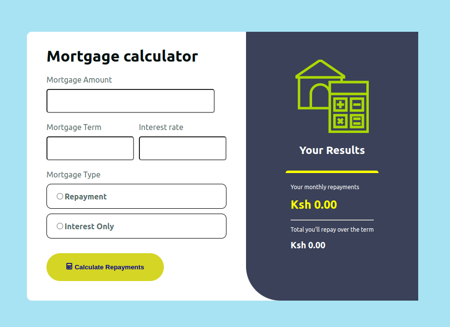
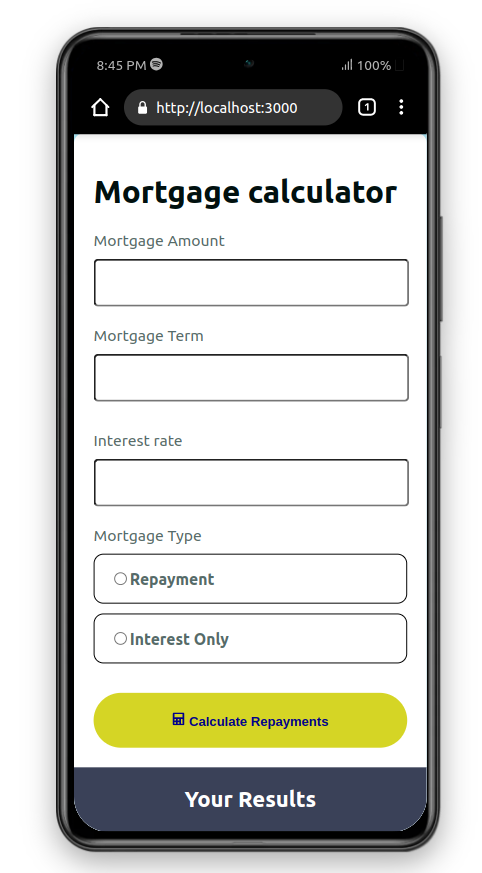

## Mortgage Calculator

The Mortgage Calculator is a React-based application designed to help users calculate their monthly mortgage repayments based on the loan amount, term, interest rate and type of mortgage. This tool can be useful for home buyers, real estate agents and financial advisors.

## Features
- Calculate monthly mortgage repayments.
- Two types of mortgage calculations: Repayment and Interest Only.
- User-friendly interface with clear input fields and results  display.

 ### Installation
#### 1. Clone the repository:

    <pre><code>
    git clone https://github.com/Caleb-ne1/mortgage-Calculator.git
    </code></pre>

#### 2. Navigate to the project directory:

    <pre><code>
    cd mortgage-Calculator
    </code></pre>

#### 3. Install the dependencies:

    <pre><code>
    npm install
    </code></pre>

#### 4. Start the development server:

    <pre><code>
    npm start
    </code></pre>

5. Open your browser and go to http://localhost:3000 to view the application.

Enter the mortgage amount, term, interest rate and select the type of mortgage to calculate the repayments.
